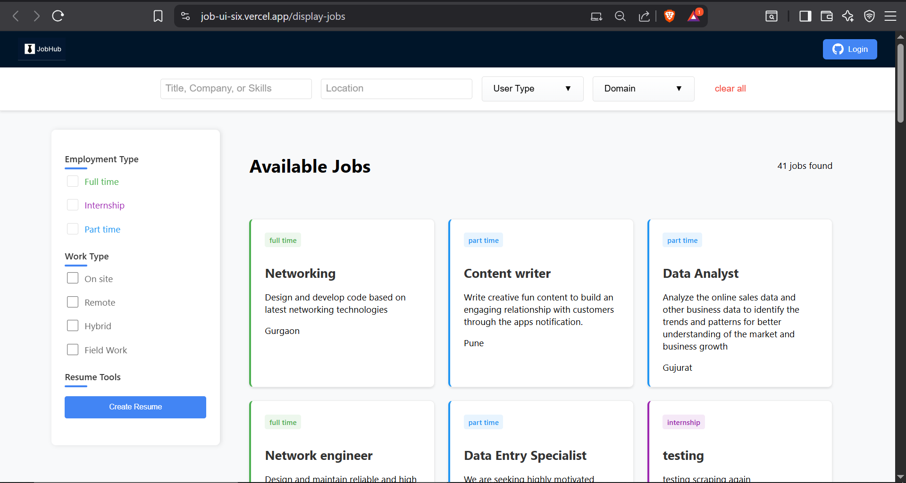
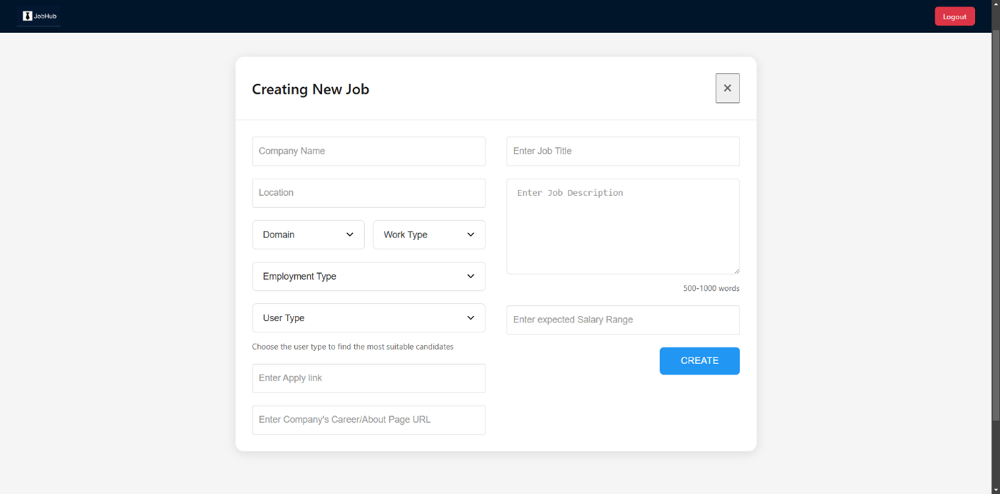
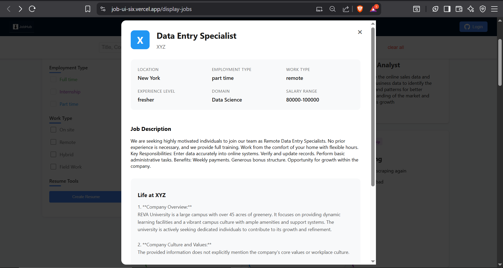
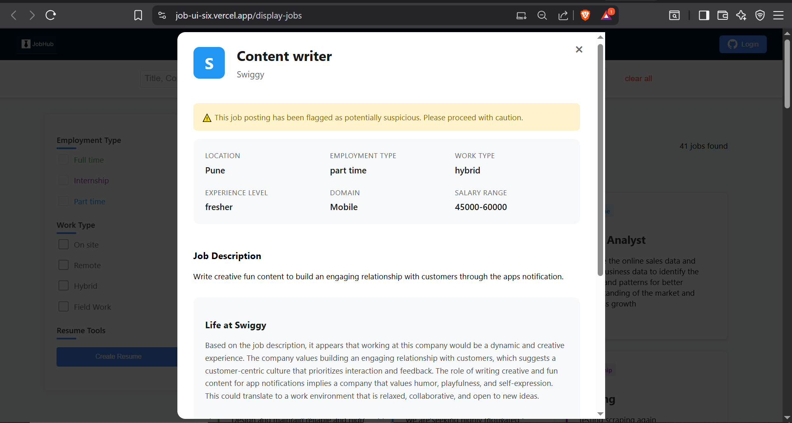
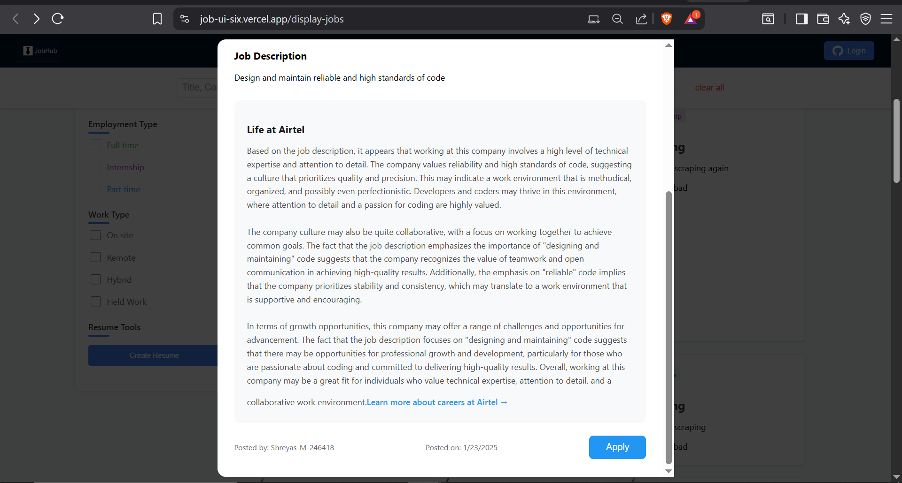
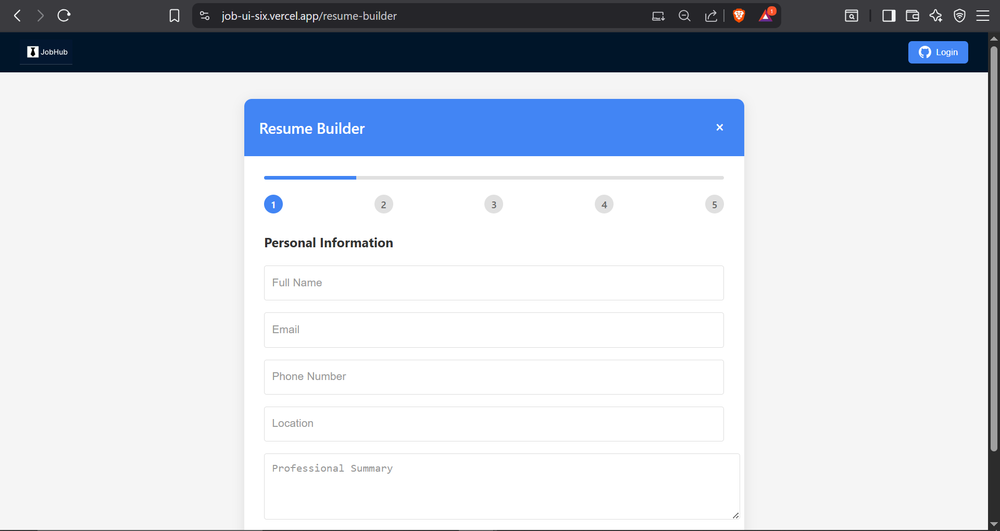
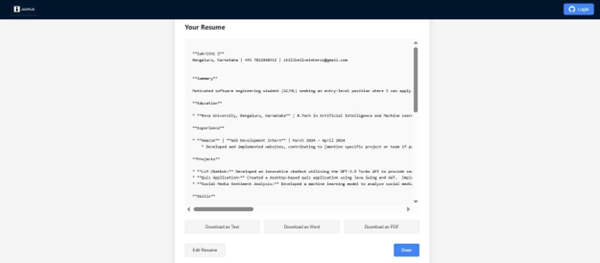

# Job Hub – Job Listing Application

A modern job listing application built with React (frontend) and Node.js/Express (backend), using Firebase for authentication and GitHub OAuth. The frontend is deployed on Vercel, and the backend is deployed on Render.

---
## About This Project

This project is an MVP (Minimum Viable Product) of a static job portal. The goal was to validate the concept of a simple, lightweight platform for job listings, before investing in a dynamic or database-driven solution. It demonstrates:

- Basic job listing and filtering functionality
- User-friendly UI
- Rapid development with minimal costs

This MVP was developed to test user engagement and gather feedback for potential future enhancements.

---

## Table of Contents

- [Features](#features)
- [Prerequisites](#prerequisites)
- [Installing Dependencies](#installing-dependencies)
- [Setting Up GitHub OAuth](#setting-up-github-oauth)
- [Environment Variables](#environment-variables)
- [Running Locally](#running-locally)
- [Deploying to Vercel (Frontend)](#deploying-to-vercel-frontend)
- [Deploying to Render (Backend)](#deploying-to-render-backend)

---

## Features

## 🚀 Features

- **Static Site Architecture:** High performance and low server costs using GitHub Pages or Vercel.
- **GitHub Integration for Job Management:** Employers can manage job postings via GitHub Issues and Pull Requests.
- **Secure GitHub OAuth Authentication:** Easy and secure login for users.
- **Real-Time Job Search and Filtering:** Search jobs by title, location, domain, work type, and more, all without page reloads.
- **AI-Powered Job Analysis:** Local spam detection and company sentiment analysis using Transformer.js.
- **Resume Builder with GenAI:** Generates professional resumes with customizable templates and language.
- **Automated Social Media Content Creation:** Helps employers promote jobs on social media.
- **Responsive and Accessible UI:** Works seamlessly across devices with accessible design principles.
- **Future-Ready Architecture:** Designed for future features like ATS, dashboards, and multilingual support.

> **MVP Note:** This platform is an MVP to validate building a lightweight, static job portal integrated with AI and GitHub-driven workflows.


## Prerequisites

- Node.js (v14 or later)
- npm (comes with Node.js)
- A GitHub account
- Gemini account
- Vercel account (for frontend deployment)
- Render account (for backend deployment)

---

## Installing Dependencies

Clone the repository and install dependencies for both frontend and backend:

```bash
Open a terminal and move to the main folder and run the following command:
npm install           
```

---

## Setting Up GitHub OAuth

1. Go to [GitHub Developer Settings](https://github.com/settings/developers).
2. Click on "OAuth Apps" > "New OAuth App".
3. Fill in:
   - **Application name:** Your app's name
   - **Homepage URL:** `your_vercel_url`
   - **Authorization callback URL:** `your_vercel_url/auth/github/callback`
4. After creating, note the **Client ID** and **Client Secret**.
5. In the Firebase Console:
   - Go to "Authentication" > "Sign-in method".
   - Enable "GitHub" and enter the Client ID and Secret.
   - Copy the callback URL from Firebase and update it in your GitHub OAuth app if needed.

---

## Environment Variables

Create a `.env` file in both the frontend and backend root directories.

### Frontend (`.env`)


---

## Running Locally

### Frontend

```bash
npm start
```

### Backend

```bash
cd server
node server.js
```

---

## Deploying to Vercel (Frontend)

1. Push your code to GitHub.
2. Go to [Vercel](https://vercel.com/) and import your repository.
3. Set the environment variables in the Vercel dashboard (Settings > Environment Variables).
4. Deploy the project.
5. Your app will be live at `https://project_name.vercel.app` (or your Vercel-assigned domain).

---

## Deploying to Render (Backend)

1. Push your backend code to GitHub (if in a separate repo/folder).
2. Go to [Render](https://render.com/) and create a new Web Service.
3. Connect your GitHub repository.
4. Set the environment variables in the Render dashboard.
5. Set the build and start commands (e.g., `npm install` and `npm start`).
6. Deploy the service.
7. Your backend will be live at `https://project_name.onrender.com`.

---

---

## 🌐 Live Demo

[Click here to view JobHub live](https://job-ui-six.vercel.app/display-jobs)

---

## 📸 Screenshots

### Homepage



### Job Posting Page



### Job Description



### Spam Job Posting



### AI Generated Content



### Resume Builder



### Generated Resume



